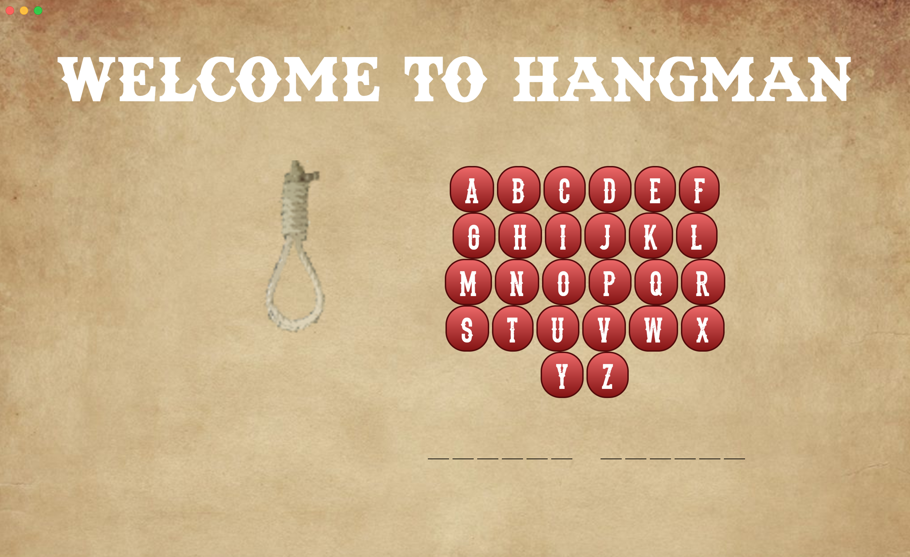

# Our first app built with Electron


We were tasked with learning Electron and building our first app with it over the course of a weekend. Our group pair programmed the entire app.

For the docs on Electron please [click here](https://github.com/electron/electron).


First, we set up our repo and then ran the following in our command line: 

```sh
npm init

# Install as a development dependency
npm install electron --save-dev

# Install the `electron` command globally in your $PATH
npm install electron -g
```

You can also run the following (instead of the above) for a pre-buit version of electron:

```
npm init

npm install electron-prebuilt --save-dev
```

We then created a main.js file and wrote the below. We left in the openDevTools line when we were getting started so that the dev tools automatically opened whenever we opened the app. We also set up a minimum width and height, which is not necessary for setup.

```
const electron = require("electron");
const app = electron.app;
const BrowserWindow = electron.BrowserWindow;
var mainWindow = null;


app.on("ready", function(){
  mainWindow = new BrowserWindow({
    width:1300,
    height: 800,
    minWidth:1300,
    minHeight: 800
    });
  // mainWindow.webContents.openDevTools();
  mainWindow.loadURL(`file://${__dirname}/app/index.html`);
});
```

Then in our package.JSON we added a start script within the scripts object that looks like the below:

```
"start": "electron ."
```

Then we created our index.html file in our app folder and wrote in some text to test.
Then to open our app, you just run:
```
npm start
```

It was as simple as that to build our first Electron app! We then pair programmed the logic for our Hangman app which was all written in JS:


After creating our app, we used [Electron Packager](https://github.com/electron-userland/electron-packager) to package our app. 


